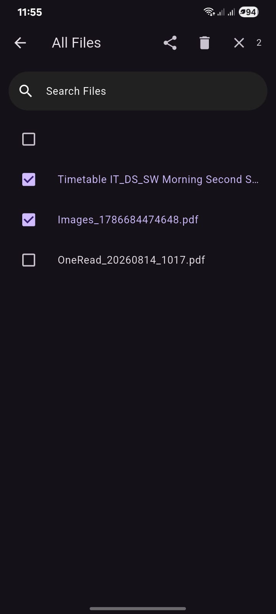
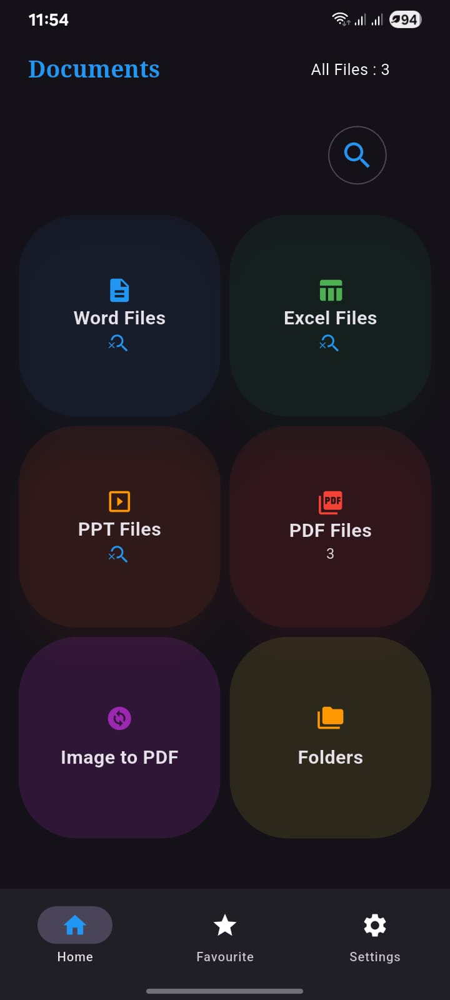
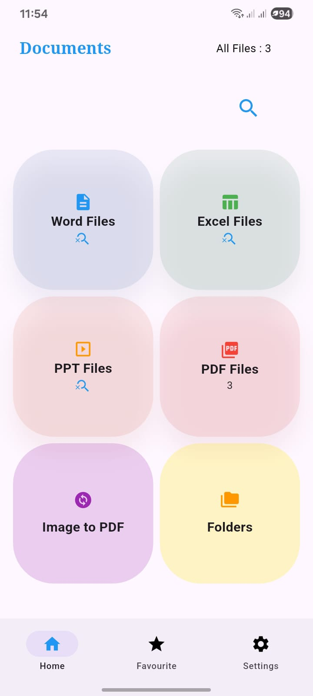
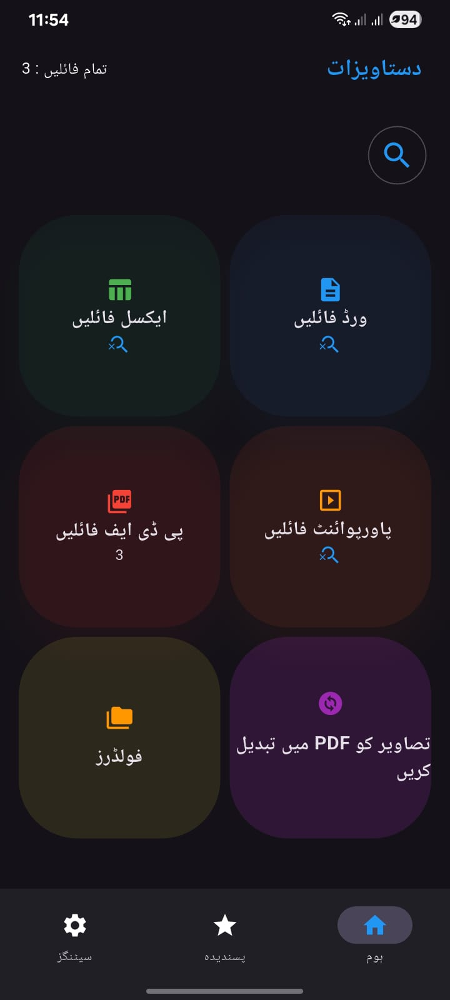
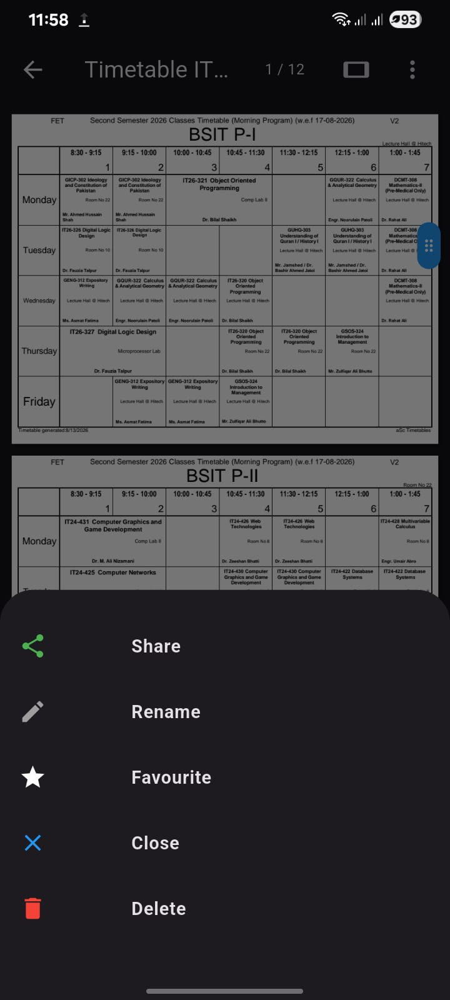
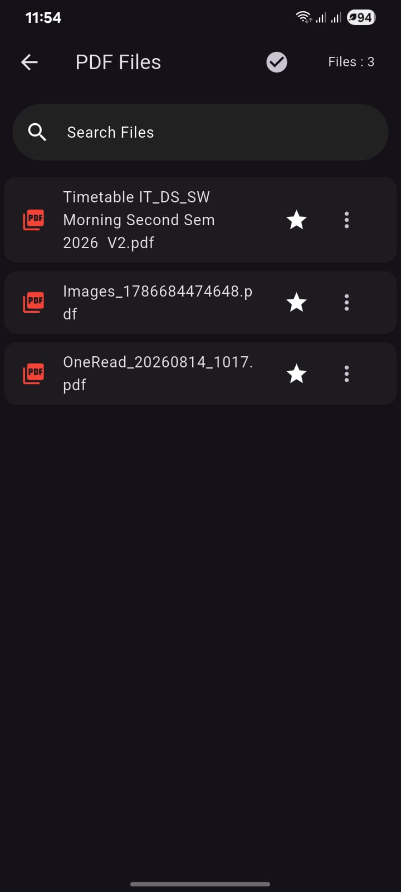
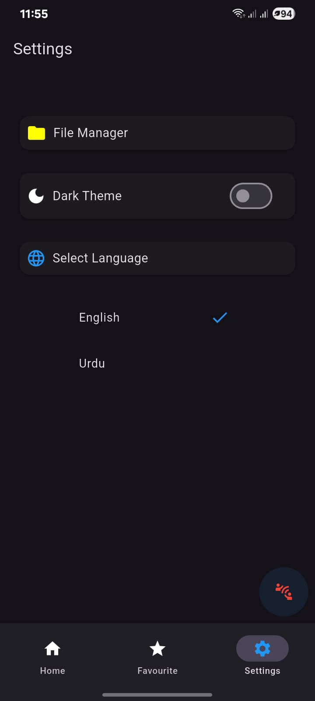

# pdf_reader

This is the updated look of my pdf reader app in which i have updated so many things. 

## Features
- image to pdf conversion, 
- creating folders and directories 
- put files into directories, 

- multiple files system as 
- share,
- rename,
- fav/un-fav items,
- delete or remove,
- open or close file

- added new splash screen, 
- whatsapp file opening support and much more.

## Technologies

- Flutter for UI
- Dart for logic,
- Android native for URI and storage syncing,
- Riverpod for state management

## Tools

- Android Studio 
- Real device / Emulator,
- pub.dev packages

## Screen shots

## Screenshots

  

  

    

    

